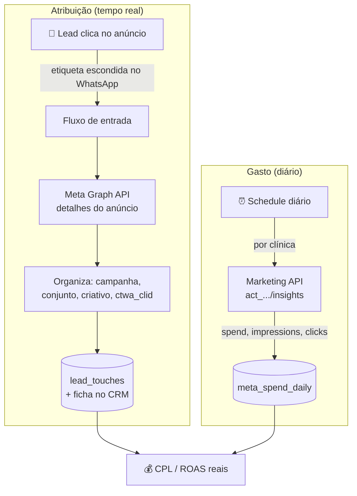

# 📊 Atribuição de Meta Ads & Coleta de Gasto

> Liga cada **lead do WhatsApp ao anúncio que o trouxe** e coleta o **gasto diário** das campanhas — para a clínica saber, de verdade, qual anúncio dá retorno (não só clique).

> 🔒 **Case anonimizado.** Sem nome de cliente, credenciais ou dados reais.

---

## 🎯 O problema

A clínica gasta em anúncio no Instagram/Facebook, mas não sabe **qual campanha traz paciente**. O gerenciador da Meta mostra cliques e custo por clique — mas não mostra quem **virou consulta** lá no WhatsApp.

Sem ligar o lead → anúncio → agendamento, o ROI fica no escuro e o orçamento é alocado no chute.

## ✅ A solução

Duas peças que se complementam:

1. **Atribuição em tempo real** — quando o lead clica em "Enviar mensagem" num anúncio, o WhatsApp carrega uma etiqueta escondida com o id do anúncio. O fluxo lê essa etiqueta, consulta a Meta Graph API e grava a origem (campanha, conjunto, criativo) no CRM e no banco.
2. **Coleta diária de gasto** — um job agendado puxa o `spend` por campanha/dia da Marketing API e grava no Postgres, pronto pra cruzar com receita e calcular CPL e ROAS.

---

## 🏗️ Arquitetura

---

## 🧩 Destaques técnicos

- **Atribuição via `ctwa_clid`** (click-to-WhatsApp): captura o id do clique e os metadados do anúncio direto do payload do WhatsApp + Graph API.
- **Deduplicação com cache:** marca em Redis quem já foi classificado, pra não reconsultar a Graph API à toa (e respeitar rate limit).
- **Janela de propagação:** espera alguns segundos antes de re-buscar o contato/oportunidade, dando tempo da Meta e do CRM propagarem.
- **Multi-tenant:** cada clínica tem seu próprio access token (idealmente **System User token sem expiração**), resolvido por configuração na hora da chamada.
- **Rate limit consciente:** leitura dos headers `X-Business-Use-Case-Usage` / `X-App-Usage` para back-off antes de estourar o limite.
- **Versão fixada da API** (`/v25.0/`) — nunca usa URL sem versão, que cairia na versão mais antiga suportada.

> 📚 Este case incluiu mapear **toda a superfície da Meta Graph API** relevante para clínicas — Marketing API, Lead Ads, WhatsApp Cloud API, Conversions API (CAPI), Webhooks e Business Manager — com escopos, rate limits e tratamento de erros (#190, #17, #100, etc.).

## 🧰 Stack

| Camada | Tecnologia |
|---|---|
| Coleta / orquestração | n8n (Schedule + HTTP) |
| Dados de anúncio | Meta Graph API v25.0 (Marketing API) |
| Armazenamento | Supabase (`lead_touches`, `meta_spend_daily`) |
| Cache | Redis |
| Atribuição | click-to-WhatsApp (`ctwa_clid`) |

## 📈 Resultados

> Exemplos do que medir:
> - 💰 Visibilidade de **CPL real** (custo por lead que virou conversa)
> - 📊 ROAS por campanha, cruzando gasto × receita
> - ✂️ Corte de orçamento em campanhas que traziam clique mas não paciente

---

## 🔗 Projetos relacionados

- [ai-receptionist-clinics](https://github.com/iTristaoo/ai-receptionist-clinics) — onde a atribuição é capturada no primeiro contato
- [multitenant-clinic-dashboard](https://github.com/iTristaoo/multitenant-clinic-dashboard) — onde os números de ROI são exibidos
